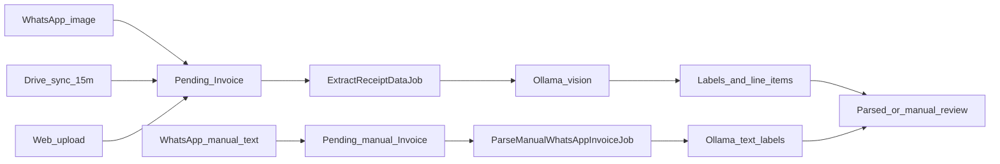

<p align="center">
  
  
</p>

<p align="center">
  
  
  
  
  
</p>

<p align="center">
  <strong>Keep it <ins>ti</ins>dy. Get it <ins>do</ins>ne.</strong><br>
  Where <ins>ti</ins>dy preparation meets <ins>do</ins>ne work, then <ins>tido</ins> (sleep)
</p>

<p align="center">
  <sub><em>// <ins>tido</ins> is derived from how people in Terengganu (one of the East state of Malaysia) say and write "tidur", which translates to "sleep" in English.</em></sub>
</p>

<p align="center">
tido is a localized, single-tenant MYR expense tracker built for frictionless financial logging. Ingest receipts via WhatsApp (image or text manual invoice), scheduled Google Drive sync, or admin upload, and parse on-device with Ollama (`qwen2.5vl:7b`). Manage parsed line items as labels, track strict budgets, and review analytics instantly within a streamlined Filament dashboard.
</p>

## Table of Contents

- [Features](#features)
- [Stack](#stack)
- [Architecture](#architecture)
- [Installation](#installation)
- [Usage](#usage)
- [Configuration](#configuration)
- [Testing](#testing)
- [Documentation](#documentation)
- [Contributing](#contributing)
- [License](#license)

## Features

- Receipt ingestion from WhatsApp (Evolution API: **images** + **text manual invoices**), Google Drive **scheduled** sync (every 15m), and admin upload
- Local OCR via Ollama (`qwen2.5vl:7b`) with JSON-formatted extraction; manual WhatsApp text uses Ollama for **Labels** only
- Line-item **Labels**, duplicate detection (`receipt_hash`), and manual review
- Per-label budgets with WhatsApp threshold alerts
- Month-scoped dashboard analytics and spending forecast
- Redis queues via Laravel Horizon (`default`, `receipts`, `whatsapp`) in production; `database` queue locally
- Form draft auto-save and crash recovery on Filament Create/Edit
- Spatie backups, one-time restore tokens, guest restore, and profile Danger Zone

## Stack

| Layer | Technology |
|-------|------------|
| App | Laravel 12, PHP 8.2+ |
| Admin UI | Filament v5, Livewire 4, Tailwind CSS v4 |
| Database | SQLite (default local); PostgreSQL 17 (production target) |
| Queues | `database` driver locally; Redis + Horizon in production |
| OCR | Ollama (`qwen2.5vl:7b`, native host) |
| WhatsApp | Evolution API (native host) |
| Drive | `masbug/flysystem-google-drive-ext` |
| Backups / audit | Spatie Laravel Backup, Spatie Activity Log |
| Tests | Pest v3 |
| Dev env | Windows host PHP (`npm run dev:full`) |

## Architecture



Invoice statuses: `pending` → `parsed` → `reviewed` (or `requires_manual_review` / `failed`). Image receipts (WhatsApp, Drive, or Filament web upload) share the vision path; WhatsApp **manual text** skips vision OCR, uses Ollama for Labels only, and always lands on `requires_manual_review`. Both paths end at `Parsed_or_manual_review`. Duplicates use SHA-256 `receipt_hash` (number + datetime + total). Expense tags are the **`Label`** model / `labels` table (UI: **Label** / **Labels**).

Scheduled jobs (`routes/console.php`): Drive sync every 15 minutes; `backup:run` daily 02:00; `backup:clean` daily 03:00.

Full blueprint: [docs/system-architecture.md](docs/system-architecture.md).

## Installation

### Prerequisites

- Windows 10/11
- PHP 8.2+, Composer, Node.js
- [Ollama for Windows](https://ollama.com/download) — see [docs/ollama-setup.md](docs/ollama-setup.md)
- Evolution API clone (sibling repo) — see [docs/evolution-local-windows.md](docs/evolution-local-windows.md)
- NVIDIA GPU recommended for faster Ollama vision parsing

### Setup

One-shot (SQLite + database queue defaults from `.env.example`):

```bash
composer setup
php artisan db:seed
```

Or step by step:

```bash
composer install
cp .env.example .env
php artisan key:generate
php artisan migrate --seed
npm install
npm run build
```

Pull the Ollama vision model (once):

```bash
ollama pull qwen2.5vl:7b
curl http://127.0.0.1:11434/api/tags
```

### Run locally

| Process | Command / notes |
|---------|-----------------|
| All-in-one | `npm run dev:all` — Vite + serve :2000 + queue + Evolution + Ollama helper |
| tido only | `npm run dev:full` — Vite + `artisan serve --host=0.0.0.0 --port=2000` + queue listener |
| Evolution | `npm run evolution` — API at `http://127.0.0.1:8080` |
| Scheduler (optional) | `php artisan schedule:work` — Drive sync + backups |

Webhook URL while developing: `http://127.0.0.1:2000/api/webhooks/whatsapp`.

Also available: `composer run dev` (serve + queue + Pail + Vite, no Evolution).

**Mobile (same Wi‑Fi):**

1. Find this PC’s IPv4 (`ipconfig` → e.g. `192.168.100.6`).
2. Set `APP_URL=http://192.168.x.x:2000` in `.env` (restart `npm run dev:full`).
3. Optionally set `WHATSAPP_PUBLIC_APP_URL` to the same base for WhatsApp links.
4. If the phone cannot connect, allow inbound TCP **2000** and **5173** in Windows Firewall.
5. On the phone: open `http://192.168.x.x:2000/admin`.

Default seeded login: `admin@tido.local` / `password`.

Outside `local`, allow Horizon dashboard access by adding emails to the `viewHorizon` gate in [`app/Providers/HorizonServiceProvider.php`](app/Providers/HorizonServiceProvider.php) (the allowlist starts empty).

Integration setup guides: [Ollama](docs/ollama-setup.md) · [Evolution API](docs/evolution-local-windows.md) · [Google Drive](docs/google-drive-setup.md).

## Usage

Admin nav:

- **Finances** — Invoices, Budgets
- **Settings** — Labels, WhatsApp Connection, Backups

**WhatsApp OTP login:** Pair Evolution → set `PERSONAL_WHATSAPP_NUMBER` (and match the user’s phone) → `php artisan whatsapp:ping` → sign in with OTP at `/admin/login`.

**WhatsApp receipt image:** Send a photo/document from an allowlisted number → batched “Document received” → Ollama vision parse → “Document parsed” with edit link.

**WhatsApp manual invoice (no receipt image):** Send text in this format (each line ends with `;`). Optional payment token after the merchant: `qr`, `tngo`, `card` (Mastercard), `cash` (default if omitted), `visa`, etc.

```
Kedai Makan Seri Ayu, qr;
Nasi + ikan keli, 1, 12;
Teh o ais, 1, 2.5;
```

Multiple merchant blocks in one message (or rapid messages) create multiple invoices. Totals are summed from line totals; currency is MYR; status becomes `requires_manual_review` after AI labels. Full format, tokens, and replies: [docs/whatsapp-manual-invoice.md](docs/whatsapp-manual-invoice.md).

**WhatsApp text commands:** `spend` / `total` — this month’s spending; other text — help.

**Backups:** Cataloged ZIPs under Settings → Backups. Restore tokens are shown once (email/UI); only a hash is stored. After Danger Zone account wipe, guest restore is available when no users exist. Details: [docs/backups-and-danger-zone.md](docs/backups-and-danger-zone.md).

Useful commands:

```bash
php artisan horizon
php artisan schedule:work
php artisan whatsapp:ping
php artisan backup:run
php artisan test --compact
composer test
npm run build
npm run dev:full
```

## Configuration

Copy `.env.example` and set values for your environment. Notable groups:

<details>
<summary>Notable environment variables</summary>

| Variable | Purpose |
|----------|---------|
| `DB_*` | Database (SQLite default locally) |
| `QUEUE_CONNECTION` | `database` locally; `redis` + Horizon in production |
| `SESSION_LIFETIME` | Session minutes (default `10080` = 7 days) |
| `EVOLUTION_API_URL` | Evolution base URL |
| `EVOLUTION_API_KEY` | API + webhook Bearer token |
| `EVOLUTION_INSTANCE_NAME` | Instance name (default `tido`) |
| `PERSONAL_WHATSAPP_NUMBER` | Primary number: OTP login, panel identity, budget alerts, seeded admin phone |
| `PERSONAL_WHATSAPP_EXTRA_NUMBERS` | Extra numbers for receipt import / bot only (no panel OTP) |
| `OLLAMA_HOST` | Ollama HTTP API (default `http://127.0.0.1:11434`) |
| `OLLAMA_MODEL` | Vision model (default `qwen2.5vl:7b`) |
| `OLLAMA_TIMEOUT` | Ollama HTTP timeout seconds (default `120`) |
| `GOOGLE_DRIVE_CLIENT_ID` | Drive OAuth client |
| `GOOGLE_DRIVE_CLIENT_SECRET` | Drive OAuth secret |
| `GOOGLE_DRIVE_REFRESH_TOKEN` | Drive refresh token |
| `GOOGLE_DRIVE_FOLDER_ID` | Folder polled by `SyncGoogleDriveJob` (not push/Pub/Sub) |

</details>

## Testing

```bash
php artisan test --compact
composer test
vendor/bin/pint --dirty --format agent
```

Tests use in-memory SQLite. Mock external HTTP and queues with `Http::fake()` / `Queue::fake()` — never call live Ollama or Evolution in tests.

## Documentation

Deep docs live under [`docs/`](docs/README.md):

| Doc | Purpose |
|-----|---------|
| [agent-onboarding.md](docs/agent-onboarding.md) | Product map for agents and contributors |
| [system-architecture.md](docs/system-architecture.md) | Architecture blueprint |
| [ollama-setup.md](docs/ollama-setup.md) | Native host Ollama / qwen2.5vl:7b |
| [evolution-local-windows.md](docs/evolution-local-windows.md) | Evolution instance + webhook (Windows host) |
| [whatsapp-manual-invoice.md](docs/whatsapp-manual-invoice.md) | Text-only WhatsApp manual invoice format |
| [google-drive-setup.md](docs/google-drive-setup.md) | Drive folder sync credentials |
| [backups-and-danger-zone.md](docs/backups-and-danger-zone.md) | Backups, restore tokens, Danger Zone |
| [content-draft-recovery.md](docs/content-draft-recovery.md) | Form draft auto-save / crash recovery |
| [git-workflow.md](docs/git-workflow.md) | Branching and PRs |
| [ui-tooltips.md](docs/ui-tooltips.md) · [ui-dark-theme.md](docs/ui-dark-theme.md) · [ui-empty-states.md](docs/ui-empty-states.md) · [ui-copy-style.md](docs/ui-copy-style.md) · [ui-modal-overlay.md](docs/ui-modal-overlay.md) | Filament UI conventions |

Full index: [docs/README.md](docs/README.md).

## Contributing

1. Update `main`, then branch: `feature/<short-kebab>` or `fix/<short-kebab>`
2. Keep changes focused; run Pint and affected Pest tests
3. Open a **PR into `main`**; delete the branch after merge
4. Do **not** develop features on `main`, `staging`, or `production`
5. Future promotion path (when those servers exist): `main` → `staging` → `production`

Details: [docs/git-workflow.md](docs/git-workflow.md). Coding standards: PSR-12, `declare(strict_types=1);`, Laravel Pint.

## License

tido is open-sourced software licensed under the [MIT license](LICENSE).
