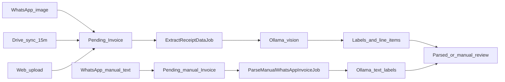

<p align="center">
  
  
</p>

<p align="center">
  
  
  
  
  
</p>

<p align="center">
  <strong>Keep it <ins>ti</ins>dy. Get it <ins>do</ins>ne.</strong><br>
  Where <ins>ti</ins>dy preparation meets <ins>do</ins>ne work, then <ins>tido</ins> (sleep)
</p>

<p align="center">
  <sub><em>// <ins>tido</ins> is derived from how people in Terengganu (one of the East state of Malaysia) say and write "tidur", which translates to "sleep" in English.</em></sub>
</p>

<p align="center">
tido is a localized, single-tenant MYR expense tracker built for frictionless financial logging. Ingest receipts via WhatsApp (image or text manual invoice), scheduled Google Drive sync (coming soon), or admin upload, and parse on-device with local Ollama. Manage parsed line items as labels, track strict budgets, and review analytics instantly within a streamlined Filament dashboard.
</p>

## Table of Contents

- [Features](#features)
- [Stack](#stack)
- [Architecture](#architecture)
- [Installation](#installation)
- [Usage](#usage)
- [Configuration](#configuration)
- [Testing](#testing)
- [Documentation](#documentation)
- [Contributing](#contributing)
- [License](#license)

## Features

- Receipt ingestion from WhatsApp (**images** + **text manual invoices**), Google Drive scheduled sync (coming soon), and admin upload
- Local OCR via Ollama with JSON-formatted extraction; manual WhatsApp text uses Ollama for **Labels** only
- Line-item **Labels**, duplicate detection, and manual review
- Per-label budgets with WhatsApp threshold alerts
- Month-scoped dashboard analytics and spending forecast
- Form draft auto-save and crash recovery on Filament Create/Edit
- Spatie backups, one-time restore tokens, guest restore, and profile Danger Zone

## Stack

| Layer           | Technology                                                |
| --------------- | --------------------------------------------------------- |
| App             | Laravel 12, PHP 8.2+                                      |
| Admin UI        | Filament v5, Livewire 4, Tailwind CSS v4                  |
| Database        | SQLite (default local); PostgreSQL 17 (production target) |
| Queues          | `database` driver locally; Redis + Horizon in production  |
| OCR             | Ollama (`qwen2.5vl:7b`, native host)                      |
| WhatsApp        | Evolution API (native host)                               |
| Drive           | `masbug/flysystem-google-drive-ext`                       |
| Backups / audit | Spatie Laravel Backup, Spatie Activity Log                |
| Tests           | Pest v3                                                   |
| Dev env         | Windows host PHP (`npm run dev:full`)                     |

## Architecture



Statuses, duplicates, Labels, and schedules: [docs/system-architecture.md](docs/system-architecture.md). Domain cheat sheet: [docs/agent-onboarding.md](docs/agent-onboarding.md).

## Installation

### Prerequisites

- Windows 10/11
- PHP 8.2+, Composer, Node.js
- [Ollama for Windows](https://ollama.com/download) — see [docs/ollama-setup.md](docs/ollama-setup.md)
- Evolution API clone (sibling repo) — see [docs/evolution-local-windows.md](docs/evolution-local-windows.md)
- NVIDIA GPU recommended for faster Ollama vision parsing

### Setup

One-shot (SQLite + database queue defaults from `.env.example`):

```bash
composer setup
php artisan db:seed
```

Or step by step:

```bash
composer install
cp .env.example .env
php artisan key:generate
php artisan migrate --seed
npm install
npm run build
```

Pull the vision model once — see [docs/ollama-setup.md](docs/ollama-setup.md).

### Run locally

| Command | Process and notes |
|---------|-------------------|
| `npm run build` | Build assets — Vite production build |
| `npm run dev` | Vite only — Vite HMR (Hot Module Replacement) |
| `npm run dev:full` | tido only — Vite + `artisan serve` :2000 + queue |
| `npm run evolution` | Evolution — Evolution API :8080 (standalone) |
| `npm run dev:whatsapp` | tido + Evolution — tido (`dev:full`) + Evolution |
| `npm run dev:ollama` | Ollama helper — Ollama serve helper (standalone) |
| `npm run dev:all` | All-in-one — WhatsApp stack (`dev:whatsapp`) + Ollama |

**Mobile (same Wi‑Fi):**

1. Find this PC’s IPv4 (`ipconfig` → e.g. `192.168.100.6`).
2. Set `APP_URL=http://192.168.x.x:2000` in `.env` (restart `npm run dev:full`).
3. Optionally set `WHATSAPP_PUBLIC_APP_URL` to the same base for WhatsApp links.
4. If the phone cannot connect, allow inbound TCP **2000** and **5173** in Windows Firewall.
5. On the phone: open `http://192.168.x.x:2000/admin`.

Default seeded login: `admin@tido.local` / `password`.

Outside `local`, allow Horizon dashboard access by adding emails to the `viewHorizon` gate in [`app/Providers/HorizonServiceProvider.php`](app/Providers/HorizonServiceProvider.php) (the allowlist starts empty).

Setup guides: [Ollama](docs/ollama-setup.md) · [Evolution API](docs/evolution-local-windows.md) · [Google Drive](docs/google-drive-setup.md).

## Usage

Admin nav:

- **Finances** — Invoices, Budgets
- **Settings** — Labels, Payment Methods, Family Members
- **Integrations** — Evolution API
- **Tools** — Backups

**WhatsApp OTP login:** Pair Evolution → set WhatsApp number in Profile → `php artisan whatsapp:ping` → sign in with OTP at `/admin/login`.

**WhatsApp receipt image:** Send a photo/document from an allowlisted number (Profile or Family Members with allowlist enabled) → batched “Document received” → Ollama vision parse → “Document parsed” with edit link.

**WhatsApp manual invoice (no receipt image):** Text format, payment tokens, and replies: [docs/whatsapp-manual-invoice.md](docs/whatsapp-manual-invoice.md).

**WhatsApp text commands:** `spend` / `total` — this month’s spending; other text — help.

**Backups:** Cataloged ZIPs under Tools → Backups. Restore tokens are shown once (email/UI); only a hash is stored. After Danger Zone account wipe, guest restore is available when no users exist. Details: [docs/backups-and-danger-zone.md](docs/backups-and-danger-zone.md).

## Configuration

Copy [`.env.example`](.env.example) and set values for your environment. Notable groups (`DB_*`, `QUEUE_CONNECTION`, `EVOLUTION_*`, `OLLAMA_*`, `GOOGLE_DRIVE_*`) are documented there and in the [setup guides](#installation).

## Testing

```bash
php artisan test --compact
composer test
vendor/bin/pint --dirty --format agent
```

Tests use in-memory SQLite. Mock external HTTP and queues with `Http::fake()` / `Queue::fake()` — never call live Ollama or Evolution in tests.

## Documentation

Full index: [docs/README.md](docs/README.md). Product map for agents and contributors: [docs/agent-onboarding.md](docs/agent-onboarding.md).

## Contributing

1. Update `main`, then branch: `feature/<short-kebab>` or `fix/<short-kebab>`
2. Keep changes focused; run Pint and affected Pest tests
3. Open a **PR into `main`**; delete the branch after merge
4. Do **not** develop features on `main`, `staging`, or `production`
5. Future promotion path (when those servers exist): `main` → `staging` → `production`

Details: [docs/git-workflow.md](docs/git-workflow.md). Coding standards: PSR-12, `declare(strict_types=1);`, Laravel Pint.

## License

tido is open-sourced software licensed under the [MIT license](LICENSE).
