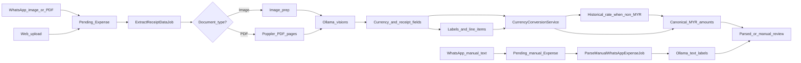

<p align="center">
  
  
</p>

<p align="center">
  
  
  
  
  
</p>

<p align="center">
  <strong>Keep it <ins>ti</ins>dy. Get it <ins>do</ins>ne.</strong><br>
  Where <ins>ti</ins>dy preparation meets <ins>do</ins>ne work, then <ins>tido</ins> (sleep)
</p>

<p align="center">
  <sub><em>// <ins>tido</ins> is derived from how people in Terengganu (one of the East Coast states of Peninsular Malaysia) say and write "tidur", which translates to "sleep" in English.</em></sub>
</p>

<p align="center">
<code>tido</code> is a single-tenant Life OS designed to bring personal finance, health, training, and everyday productivity into one private hub. <strong>Finance</strong> is currently in active development as a localized MYR expense tracker. It supports receipt ingestion through WhatsApp images and PDFs and manual admin uploads, with on-device parsing powered by local Ollama. Printed receipt currencies are detected automatically; non-MYR amounts are converted using the receipt date and retained with source-currency metadata for review. Users can manage line items with labels, track budgets, and review spending analytics from the Finance dashboard.
<strong>Training</strong> (workouts, running activities, and Strava
  sync. (TBD)), <strong>Health</strong> (calorie tracking and
  AI-assisted meal analysis from food photos), and <strong>Tasks</strong> (reminders and practical real-life task management) modules are coming soon!
</p>

## Table of Contents

- [Features](#features)
- [Stack](#stack)
- [Architecture](#architecture)
- [Installation](#installation)
- [Usage](#usage)
- [Configuration](#configuration)
- [Testing](#testing)
- [Documentation](#documentation)
- [Contributing](#contributing)
- [License](#license)

## Features

- Modular Home dashboard: **Finance** (Ongoing), **Training** / **Health** / **Task** (coming soon) — see [docs/dashboard-views.md](docs/dashboard-views.md)
- Receipt ingestion from WhatsApp (**images**, **PDFs**, and **text manual expenses**) and admin upload
- Local OCR via Ollama with JSON-formatted extraction; manual WhatsApp text uses Ollama for **Labels** only
- Printed currency detection, historical exchange-rate conversion into MYR, and source amount/rate metadata
- Line-item **Labels**, duplicate detection, and manual review
- Per-label budgets with WhatsApp threshold alerts
- Month-scoped Finance dashboard analytics and spending forecast
- Form draft auto-save and crash recovery on Filament Create/Edit
- Spatie backups, one-time restore tokens, guest restore, and profile Danger Zone

## Stack

| Layer           | Technology                                                |
| --------------- | --------------------------------------------------------- |
| App             | Laravel 12, PHP 8.2+                                      |
| Admin UI        | Filament v5, Livewire 4, Tailwind CSS v4                  |
| Database        | SQLite (default local); PostgreSQL 17 (production target) |
| Queues          | `database` driver locally; Redis + Horizon in production  |
| OCR             | Ollama (`qwen2.5vl:7b`, native host)                      |
| Exchange rates  | CurrencyAPI historical rates with cached receipt-date lookups |
| WhatsApp        | Evolution API (native host)                               |
| Backups / audit | Spatie Laravel Backup, Spatie Activity Log, resource edit audit |
| Tests           | Pest v3                                                   |
| Dev env         | Windows host PHP (`npm run dev:full`)                     |

## Architecture


```mermaid
flowchart LR
  waMedia[WhatsApp_image_or_PDF] --> pending[Pending_Expense]
  waText[WhatsApp_manual_text] --> pendingManual[Pending_manual_Expense]
  upload[Web_upload] --> pending
  pending --> job[ExtractReceiptDataJob]
  job --> prepChoice{Document_type?}
  prepChoice -->|Image| imagePrep[Image_prep]
  prepChoice -->|PDF| pdfPages[Poppler_PDF_pages]
  imagePrep --> ollama[Ollama_visions]
  pdfPages --> ollama
  ollama --> extracted[Currency_and_receipt_fields]
  extracted --> items[Labels_and_line_items]
  extracted --> convert[CurrencyConversionService]
  items --> convert
  convert --> rate[Historical_rate_when_non_MYR]
  rate --> canonical[Canonical_MYR_amounts]
  convert --> canonical
  canonical --> review[Parsed_or_manual_review]
  pendingManual --> labelJob[ParseManualWhatsAppExpenseJob]
  labelJob --> ollamaText[Ollama_text_labels]
  ollamaText --> review
```

Statuses, duplicates, Labels, schedules, and resource edit audit: [docs/system-architecture.md](docs/system-architecture.md). Domain cheat sheet: [docs/agent-onboarding.md](docs/agent-onboarding.md). Resource edit details: [docs/resource-edit-audit.md](docs/resource-edit-audit.md).

## Installation

### Prerequisites

- Windows 10/11
- PHP 8.2+, Composer, Node.js
- [Ollama for Windows](https://ollama.com/download) — see [docs/ollama-setup.md](docs/ollama-setup.md)
- Evolution API clone (sibling repo) — see [docs/evolution-local-windows.md](docs/evolution-local-windows.md)
- NVIDIA GPU recommended for faster Ollama vision parsing

### Setup

One-shot (SQLite + database queue defaults from `.env.example`):

```bash
composer setup
php artisan db:seed
```

Or step by step:

```bash
composer install
cp .env.example .env
php artisan key:generate
php artisan migrate --seed
npm install
npm run build
```

Pull the vision model once — see [docs/ollama-setup.md](docs/ollama-setup.md).

### Run locally

| Command | Process and notes |
|---------|-------------------|
| `npm run build` | Build assets — Vite production build |
| `npm run dev` | Vite only — Vite HMR (Hot Module Replacement) |
| `npm run dev:full` | tido only — Vite + `artisan serve` :2000 + queue |
| `npm run evolution` | Evolution — Evolution API :8080 (standalone) |
| `npm run dev:whatsapp` | tido + Evolution — tido (`dev:full`) + Evolution |
| `npm run dev:ollama` | Ollama helper — Ollama serve helper (standalone) |
| `npm run dev:all` | All-in-one — WhatsApp stack (`dev:whatsapp`) + Ollama |

**LAN access (same Wi‑Fi only — not a public website):**

PHP still listens on port **2000**. Map port **80** → **2000** once (Administrator; persists across reboot) so the URL has no port:

```bat
netsh interface portproxy add v4tov4 listenport=80 listenaddress=0.0.0.0 connectport=2000 connectaddress=127.0.0.1
netsh interface portproxy show all
```

If port 80 is already taken (IIS / World Wide Web Publishing), stop that service first.

1. On this PC, add `127.0.0.1 tido.local` to `C:\Windows\System32\drivers\etc\hosts` (Administrator).
2. Set `APP_URL=http://tido.local` in `.env` (restart `npm run dev:full` / `dev:all`).
3. Set `WHATSAPP_PUBLIC_APP_URL=http://<PC-LAN-IP>` (no port) so WhatsApp links open on the phone. Find the IPv4 with `ipconfig`.
4. Optional same-Wi‑Fi lock: Windows Firewall inbound TCP **80** and **5173** from the LAN subnet only (e.g. `192.168.100.0/24`), not Any / not WAN. Do not port-forward these on the router.
5. On this PC: open `http://tido.local/admin`.
6. On the phone: map `tido.local` → this PC’s LAN IPv4 (hosts or LAN DNS). If the name does not resolve (common on iOS for `.local`), open `http://<PC-LAN-IP>/admin`.

Evolution webhooks on this PC stay at `http://127.0.0.1:2000/api/webhooks/whatsapp`.

Default seeded login: `admin@tido.local` / `password`.

Outside `local`, allow Horizon dashboard access by adding emails to the `viewHorizon` gate in [`app/Providers/HorizonServiceProvider.php`](app/Providers/HorizonServiceProvider.php) (the allowlist starts empty).

Setup guides: [Ollama](docs/ollama-setup.md) · [Evolution API](docs/evolution-local-windows.md).

## Usage

Admin nav:

- **Finances** — Expenses, Budgets
- **Settings** — Labels, Payment Methods, Family Members
- **Integrations** — Evolution API
- **Tools** — Backups

**WhatsApp OTP login:** Pair Evolution → set WhatsApp number in Profile → `php artisan whatsapp:ping` → sign in with OTP at `/admin/login`.

**Account switching:** Primary accounts with login-enabled Family Members can open **Swap Account** from the user menu to switch into a linked Family Member account. Use **Switch back** from the same menu to return to the Primary account.

**WhatsApp receipt image/PDF:** Send an image or PDF from an allowlisted number (Profile or Family Members with allowlist enabled) → batched “Document received” → Ollama vision parse and printed-currency detection → historical conversion into MYR when needed → “Document parsed” with edit link. PDFs are limited to 10 MB and 4 pages by default and require Poppler (`pdfinfo` + `pdftocairo`) on the queue worker.

**WhatsApp manual expense (no receipt media):** Text format, payment tokens, and replies: [docs/whatsapp-manual-expense.md](docs/whatsapp-manual-expense.md).

**Legacy foreign-currency correction:** Preview a known legacy source-currency correction with `php artisan receipts:convert-currency 332 --source-currency=USD --dry-run`. After checking the target and configuring `CURRENCY_API_KEY`, rerun without `--dry-run` to convert the stored totals and line items without rerunning OCR.

**WhatsApp LID allowlist:** If WhatsApp delivers an inbound chat with a LID instead of a phone JID, link the pending identity to the correct allowlisted contact under **Integrations → Evolution API → WhatsApp LID**. See [docs/evolution-local-windows.md](docs/evolution-local-windows.md).

**WhatsApp text commands:** `spend` / `total` — this month’s spending; other text — help.

**Backups:** Cataloged ZIPs under Tools → Backups. Restore tokens are shown once (email/UI); only a hash is stored. Backup rows expose the latest **Edited By** username and **Edited At** recency. After Danger Zone account wipe, guest restore is available when no users exist. Details: [docs/backups-and-danger-zone.md](docs/backups-and-danger-zone.md) and [docs/resource-edit-audit.md](docs/resource-edit-audit.md).

## Configuration

Copy [`.env.example`](.env.example) and set values for your environment. Notable groups (`DB_*`, `QUEUE_CONNECTION`, `EVOLUTION_*`, `OLLAMA_*`, `PDF_*` / Poppler binaries, `CURRENCY_API_*`) are documented there and in the [setup guides](#installation). Set `CURRENCY_API_KEY` to enable non-MYR conversion; receipt-date lookups are cached and use bounded retries.

## Testing

```bash
php artisan test --compact
composer test
vendor/bin/pint --dirty --format agent
```

Tests use in-memory SQLite. Mock external HTTP and queues with `Http::fake()` / `Queue::fake()` — never call live Ollama, Evolution, or exchange-rate providers in tests.

## Documentation

Full index: [docs/README.md](docs/README.md). Product map for agents and contributors: [docs/agent-onboarding.md](docs/agent-onboarding.md). Dashboard modules: [docs/dashboard-views.md](docs/dashboard-views.md).

## Contributing

1. Update `main`, then branch: `feature/<short-kebab>` or `fix/<short-kebab>`
2. Keep changes focused; run Pint and affected Pest tests
3. Open a **PR into `main`**; delete the branch after merge
4. Do **not** develop features on `main`, `staging`, or `production`
5. Future promotion path (when those servers exist): `main` → `staging` → `production`

Details: [docs/git-workflow.md](docs/git-workflow.md). Coding standards: PSR-12, `declare(strict_types=1);`, Laravel Pint.

## License

tido is open-sourced software licensed under the [MIT license](LICENSE).
