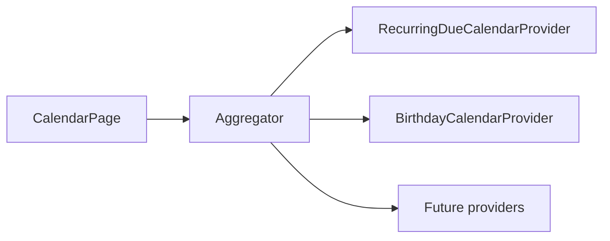

# Hub calendar

Hub-level month calendar for tido. The page aggregates events from pluggable providers — it is **not** a Finances-only feature. Finances recurring dues ship first; Training, Health, Task, and other modules can add providers later without rewriting the grid.

## Entry

- **Profile menu** → **Calendar** (`/admin/calendar`)
- **Global search** → **Calendar**

The page is hidden from the sidebar. It is not tied to a dashboard module tab — see [dashboard-views.md](dashboard-views.md).

## v1 event sources

| Provider | Module | Filter key | Data |
|----------|--------|------------|------|
| `RecurringDueCalendarProvider` | Finances | `recurring_dues` | `RecurringOccurrence` rows by `due_on`, plus projected dues when occurrences are not yet generated |
| `BirthdayCalendarProvider` | Household | `birthdays` | `users.date_of_birth` and `family_members.date_of_birth` remapped to the viewed year |

Recurring due chips link to the Recurring resource View slide-over. Projected (not yet persisted) dues render with a dashed **Scheduled** style.

## Architecture

| Layer | Path |
|-------|------|
| Page | [`app/Filament/Pages/CalendarPage.php`](../app/Filament/Pages/CalendarPage.php) |
| Grid UI | [`resources/views/filament/pages/partials/calendar-content.blade.php`](../resources/views/filament/pages/partials/calendar-content.blade.php) |
| Event DTO | [`app/Support/Calendar/CalendarEvent.php`](../app/Support/Calendar/CalendarEvent.php) |
| Module enum | [`app/Support/Calendar/CalendarModule.php`](../app/Support/Calendar/CalendarModule.php) |
| Provider contract | [`app/Support/Calendar/CalendarEventProvider.php`](../app/Support/Calendar/CalendarEventProvider.php) |
| Aggregator | [`app/Services/Calendar/CalendarEventAggregator.php`](../app/Services/Calendar/CalendarEventAggregator.php) |
| Registration | [`app/Providers/AppServiceProvider.php`](../app/Providers/AppServiceProvider.php) (singleton) |
| Styles | `.tido-calendar-*` in [`resources/css/app.css`](../resources/css/app.css) |

## Adding a new event source

1. Add a `CalendarModule` case if the module is new (reserved: `Training`, `Health`, `Task`).
2. Create `app/Services/Calendar/{Name}CalendarProvider.php` implementing `CalendarEventProvider`.
3. Return `CalendarEvent` instances for the requested date range and viewer ACL.
4. Register the provider in the `CalendarEventAggregator` singleton binding in `AppServiceProvider`.
5. The filter checkbox appears automatically via `availableFilters()`.

Do not put query logic in `CalendarPage` or the Blade view.

## Recurring dues integration

- Uses existing occurrence generation (`RecurringOccurrenceGenerator::run()` on page mount).
- Respects `RecurringOccurrence::visibleTo()` and active recurrings.
- Projects future due dates beyond the ~45-day occurrence horizon for calendar navigation (display-only until persisted).
- Listens for `recurring-occurrences-updated` and expense broadcast refresh events to update open chips.

See [recurrings.md](recurrings.md) for the reminder-first recurring pipeline.

## Tests

| File | Covers |
|------|--------|
| [`tests/Feature/CalendarPageTest.php`](../tests/Feature/CalendarPageTest.php) | Page render, dues, birthdays, navigation, filters, profile menu |
| [`tests/Unit/CalendarEventAggregatorTest.php`](../tests/Unit/CalendarEventAggregatorTest.php) | Filter catalog and merge behaviour |
| [`tests/Unit/RecurringDueCalendarProviderTest.php`](../tests/Unit/RecurringDueCalendarProviderTest.php) | Occurrence mapping, ACL, projection |
| [`tests/Unit/BirthdayCalendarProviderTest.php`](../tests/Unit/BirthdayCalendarProviderTest.php) | DOB remapping and household members |

Run: `php artisan test --compact --filter=Calendar`
