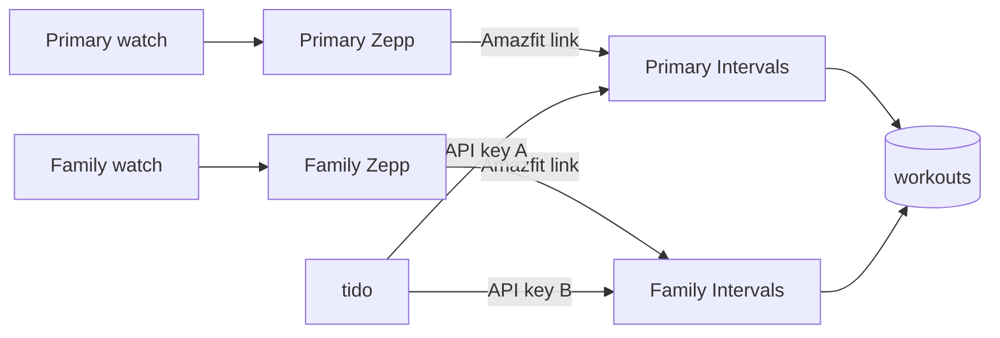

# Training module — parked design

> **Status:** Parked design (not implemented). Home **Training** remains a coming-soon shell ([dashboard-views.md](dashboard-views.md)).  
> **Do not implement from this file** until an explicit Agent-mode request. This document is the settled product shape so household athletes and a later SaaS wrap stay compatible.  
> Live contract remains single-tenant ([system-architecture.md](system-architecture.md)). Tenancy / Register / `household_id` stay in [saas-prd.md](saas-prd.md) and are **not** authorized here.

**tido** only. Training sport types are not Finances **Labels**.

---

## 1. Why this is parked

Zepp (Amazfit) is the watch source. Zepp has no public API for tido. Strava’s **My API Application** form is subscriber-only on a free Strava account, so tido will **not** be a Strava API developer.

The $0 automatic hop is **Intervals.icu** (free, donation-supported): Zepp already delivers into Intervals via **Amazfit** linking; tido polls Intervals with a personal API key.

Saving this design first avoids a singleton “one Intervals key for the install” that would block:

- Family Members on the same `/admin` each connecting **their** watch
- A later PROD SaaS phase where many **households** share one deploy ([saas-prd.md](saas-prd.md))

---

## 2. Two kinds of “multiple users”

Do not mix these. Both matter for PROD; only the first is in today’s architecture.

| Kind                                 | Who                                    | Already in tido?                                     | This design                                                                                                                                                              |
| ------------------------------------ | -------------------------------------- | ---------------------------------------------------- | ------------------------------------------------------------------------------------------------------------------------------------------------------------------------ |
| **Multi-user inside a household**    | Primary + login-enabled Family Members | **Yes** — [household-access.md](household-access.md) | One Intervals key and one workout set **per athlete** (`family_member_id`, `null` = Primary)                                                                             |
| **Isolation between signups (SaaS)** | Unrelated people on one PROD           | **No** — still one household per install             | **Do not add `household_id` in the Training implementation.** Per-athlete rows sit _inside_ a household; SaaS later wraps the whole household the same way expenses will |

**PROD today (self-host):** one database, one household. Several people can already log in as family. Training should follow that, not “only Primary has a watch.”

**PROD later (SaaS):** many households. Training tables get the same grouping key as expenses when architecture is updated. This parked schema is chosen so that wrap is additive.

---

## 3. Why not Strava (for tido)

- **tido as a Strava API app** (Settings → My API Application): tido would be a _developer_. That requires a paid Strava membership. Out of scope forever unless product explicitly pays for it.
- **Intervals.icu “Connect Strava”:** Intervals already has a Strava app. A free Strava _athlete_ can authorize Intervals. That is optional on Intervals’ site. **tido v1 does not use it.**
- **tido → Intervals.icu API key:** tido never calls Strava. **$0.**

v1 ingest: **Zepp → Intervals Amazfit box → tido**. Skip Strava so workouts never depend on Strava’s developer paywall.

---

## 4. How the hop works

Zepp stays the watch app. Intervals.icu is a **free mailbox per athlete**. tido reads every mailbox.

**One-time setup — each athlete (not once per household):**

1. Keep using that person’s Zepp app.
2. Create **their** free [intervals.icu](https://intervals.icu) account (no card).
3. Intervals → Settings → **Amazfit** → tick sports → authorize with **their** Zepp login. If Zepp used Login with Google, use Google on that authorize screen.
4. Confirm one workout appears on **their** Intervals.icu before tido is involved.
5. Copy **their** Developer Settings API key.
6. In tido, signed in as themselves: **Training → Intervals.icu** → paste key → Sync now.

Scheduled poll walks **all** `intervals_icu_connections`. No monthly fee to Intervals or Strava.

---

## 5. Domain (when implemented)

### `intervals_icu_connections`

- `family_member_id` nullable unique (`null` = Primary) — same convention as expenses
- encrypted `api_key`, `athlete_id` (`0` = key owner on Intervals)
- `last_synced_at`, list cursor, `setup_completed_at`
- Do **not** use a household-wide singleton like `OllamaSetting` / `GoogleOAuthSetting`
- Optional `.env` fallback only for **Primary** local dev, never as the only store

### `workouts`

- `family_member_id` nullable (`null` = Primary)
- `intervals_activity_id` unique per athlete (SQLite: unique `(family_member_id, intervals_activity_id)` with a sentinel if nulls collide)
- `source` = `intervals_icu`
- `name`, `sport_type` (backed enum `WorkoutSportType` + `Other`)
- `started_at`, `elapsed_seconds`, `moving_time_seconds`
- `distance_meters`, `elevation_gain_meters`, `calories`, `average_heartrate`, `max_heartrate` nullable
- `device_name`, `icu_url`, `notes` (`NotesRichEditor`)
- SoftDeletes + `LogsActivity` + `TracksResourceEdits`

### `intervals_icu_sync_logs`

- `family_member_id`, event, status, counts
- Never log API keys or raw payloads

### Jobs

- `SyncIntervalsActivitiesJob` — one connection (scheduler fans out every 15 minutes)
- `IngestIntervalsActivityJob` — `GET /api/v1/activity/{id}`, upsert onto that athlete
- `App\Services\IntervalsIcu\IntervalsIcuClient` — Basic Auth username literal `API_KEY`; browser-like User-Agent (Cloudflare); 429 + `Retry-After`
- Per-key Intervals limits: 5000/day, 2500/15 minutes
- Queue: existing `default` (no new Horizon supervisor)

**ACL:** `WorkoutPolicy` + `HouseholdAccess::canMutateWorkout()` (mirror expenses). Family: own workouts and own connection. Primary: household list; mutate any. Connect/disconnect only own key.

**CRUD:** import-only. List / View slide-over (disabled form, no infolist) / Edit notes. No New Workout.

**Out of v1:** unofficial Huami/Zepp tokens, Terra as a tido dependency, sleep/HRV/daily steps (Health), GPS maps, file import, Strava OAuth, `household_id`.

---

## 6. Filament (when implemented)

**Sidebar group Training** (label **Training**, module code TRA) after Finances, before Settings. Visible to Primary **and** login-enabled Family Members (like Finances, not Settings):

- Workouts
- Intervals.icu — **own** connection page. **Not** under household Integrations (Evolution / Ollama / Google stay Primary-only)

Home `?view=training`: real widgets; `Dashboard::getWidgets()` filtered by view. Month filter + **From** (All / Primary / `family:{id}`) for Primary; family locked to self. Count Up, empty states, section nav as Finances.

Widgets: monthly overview (sessions, distance, moving time, calories), trend, by sport, Recent Workouts.

**Calendar:** `WorkoutCalendarProvider` (`CalendarModule::Training`) with the same visibility rules ([calendar.md](calendar.md)).

**Global search:** opt-in workouts + Training destinations, ACL-filtered.

Copy: impersonal, Title Case headings.

---

## 7. Security

- Encrypt `api_key`; never in logs, notifications, or activity log
- Family cannot read another member’s key
- Wipe key on disconnect
- Poll only in v1 (Intervals webhooks are for OAuth apps)
- Tests: `Http::fake()` / `Queue::fake()` — never live Intervals.icu

---

## 8. SaaS wrap (later phase only)

When [system-architecture.md](system-architecture.md) is updated for tenancy:

- Add the household/account grouping column to `intervals_icu_connections`, `workouts`, and `intervals_icu_sync_logs` the same way as `expenses`
- Do not collapse back to one Intervals key per household
- Plans (Free/Pro) attach to the **household**, not to each family login ([saas-prd.md](saas-prd.md) §7)

Until that phase: one install = one household. Family logins are enough for “multiple users on PROD” for a private deploy.

---

## 9. Implementation checklist (do not run until requested)

1. Branch `feature/training-intervals-workouts` from clean `main` (do not mix with unrelated dirty Finances work).
2. Migrations + models/factories as in §5.
3. Client + jobs + 15-minute schedule.
4. Training nav, `WorkoutResource`, Intervals page, policies, dashboard widgets, calendar provider.
5. Update architecture, dashboard-views, household-access, onboarding, integration-pages, calendar, security-audit threat-model. Keep this file as the Training source of truth (remove the parked banner when shipped).
6. Pest: per-connection sync, family cannot see sibling workouts/keys, Primary From filter, dashboard not coming soon, nav order.
7. Pint; browser Primary + family.

---

## Related docs

| Doc                                              | Role                                                               |
| ------------------------------------------------ | ------------------------------------------------------------------ |
| [dashboard-views.md](dashboard-views.md)         | Home Training tab (coming soon until this ships)                   |
| [household-access.md](household-access.md)       | Family login and mutate ACL to mirror                              |
| [saas-prd.md](saas-prd.md)                       | Future multi-household PROD; do not implement from that file       |
| [system-architecture.md](system-architecture.md) | Live blueprint; update when Training actually ships                |
| [integration-pages.md](integration-pages.md)     | Page shape for Intervals.icu (own key, not household Integrations) |
| [calendar.md](calendar.md)                       | Reserved `CalendarModule::Training`                                |
